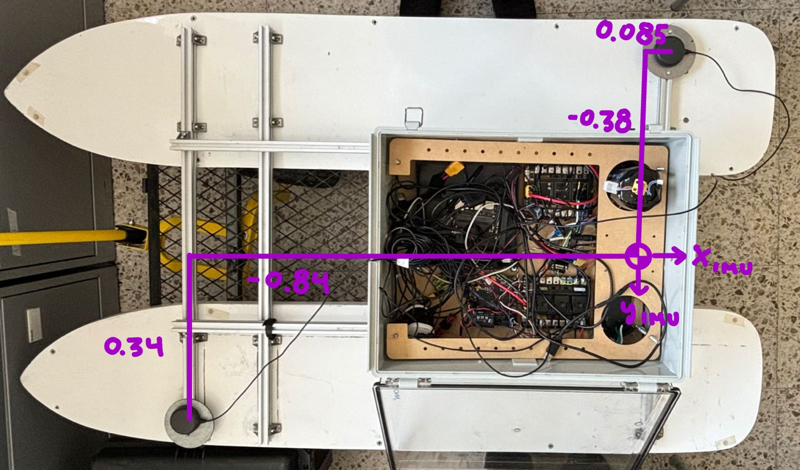

Localization
==========

Setting up ELLIPSE-2D
-------------------------------

Author:
 * Demian Marin 

Introduction
************
Having an accurate and reliable pose is critical for control. For this the ELLIPSE2-D must be properly set in order to have a smooth and precise position and orientation. Most
of this information was obtained from the manual (should be available on USV's Notion) and from technical support of SBG systems. Don' hesitate to get in contact with SBG's 
technical support if any problem arrives. But let's hope this docs saves the team time.

Antennas on the VTEC-S3
***********************

   (GNSS antennas on VTEC-S3)

Antennas should have a minimum of 1 m of separation.

Settings in sbgCenter
*********************

The position of the lever arms are with respect to the orientation of the boat. While the ellipse alignment is the IMU with respect the USV.

