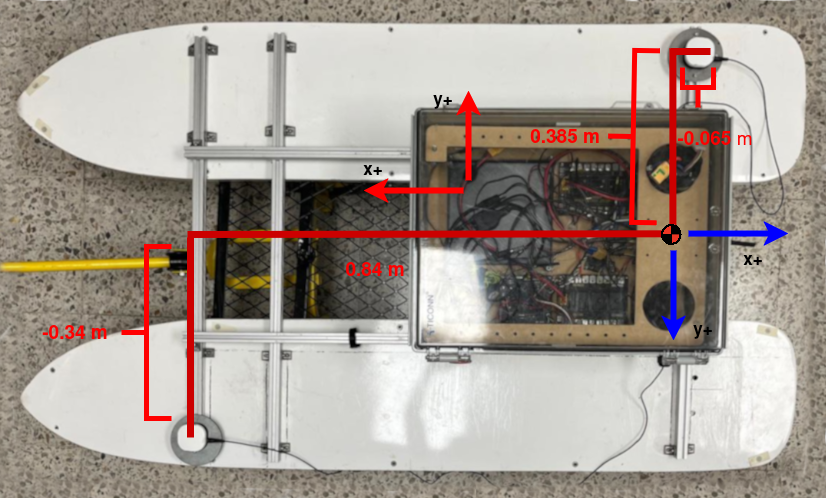
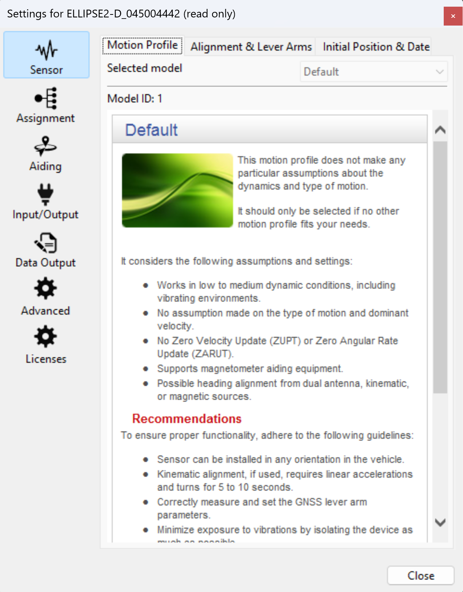
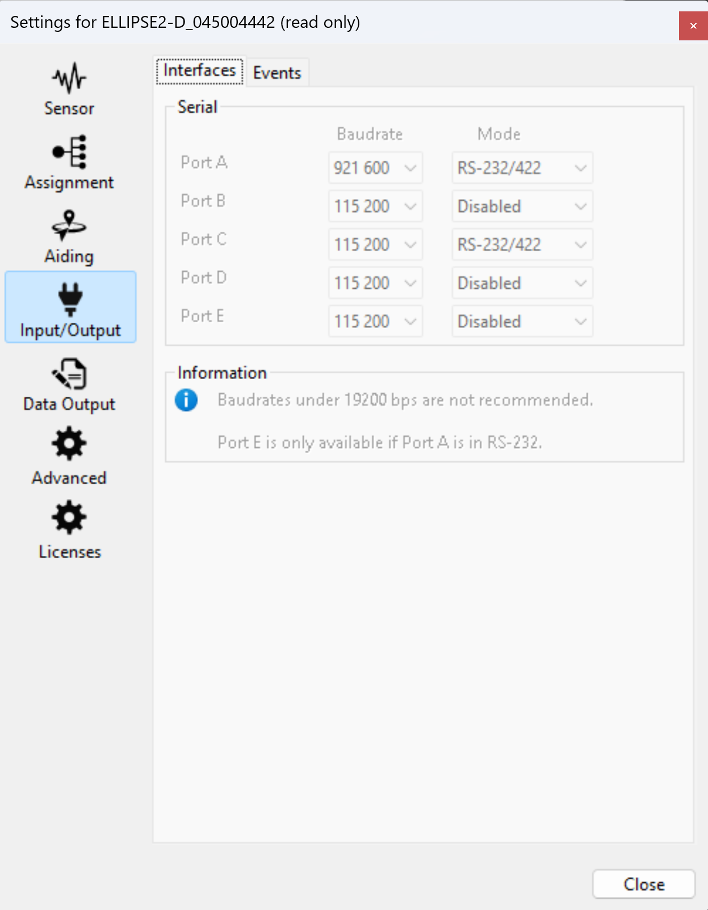
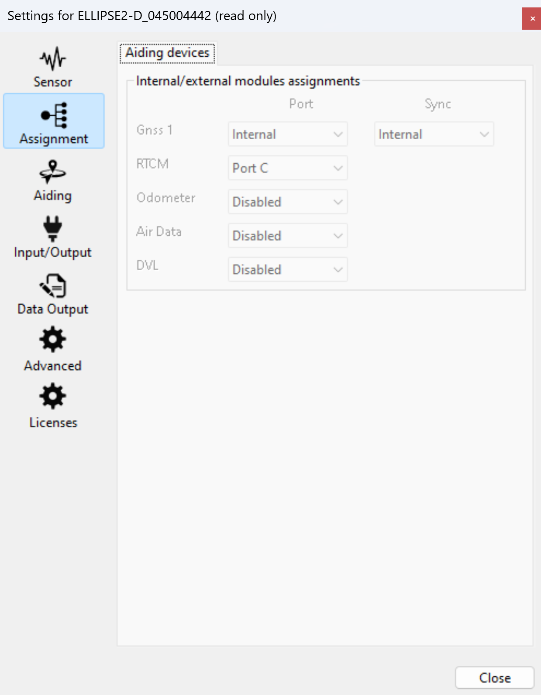
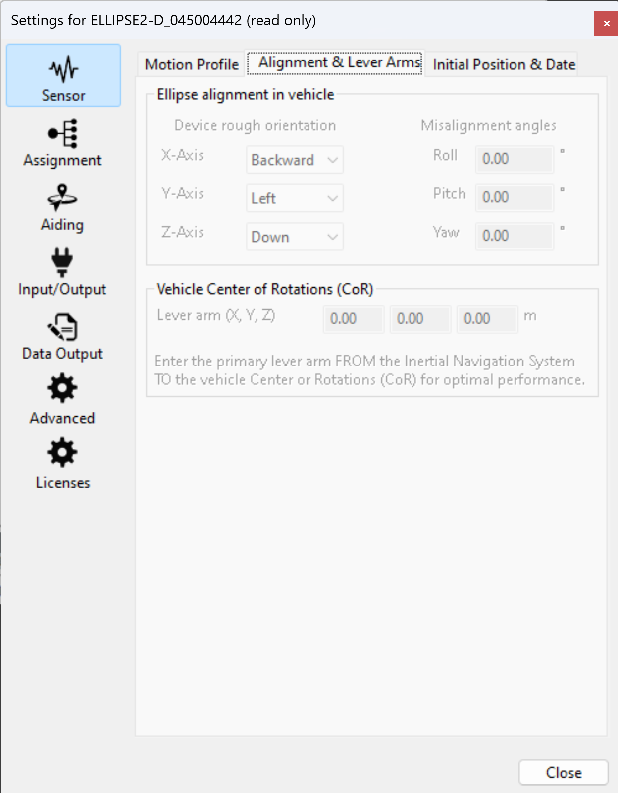
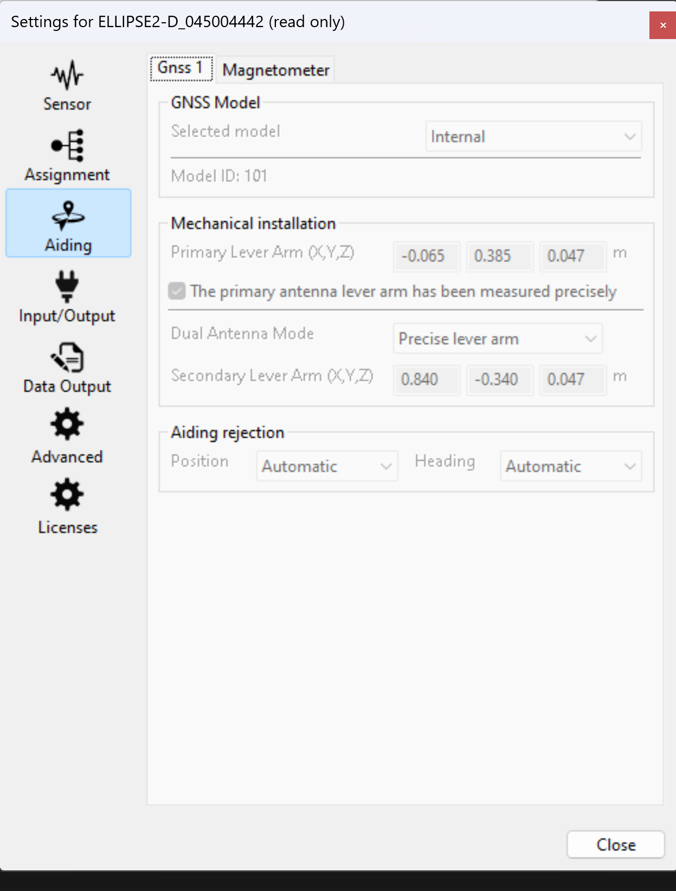
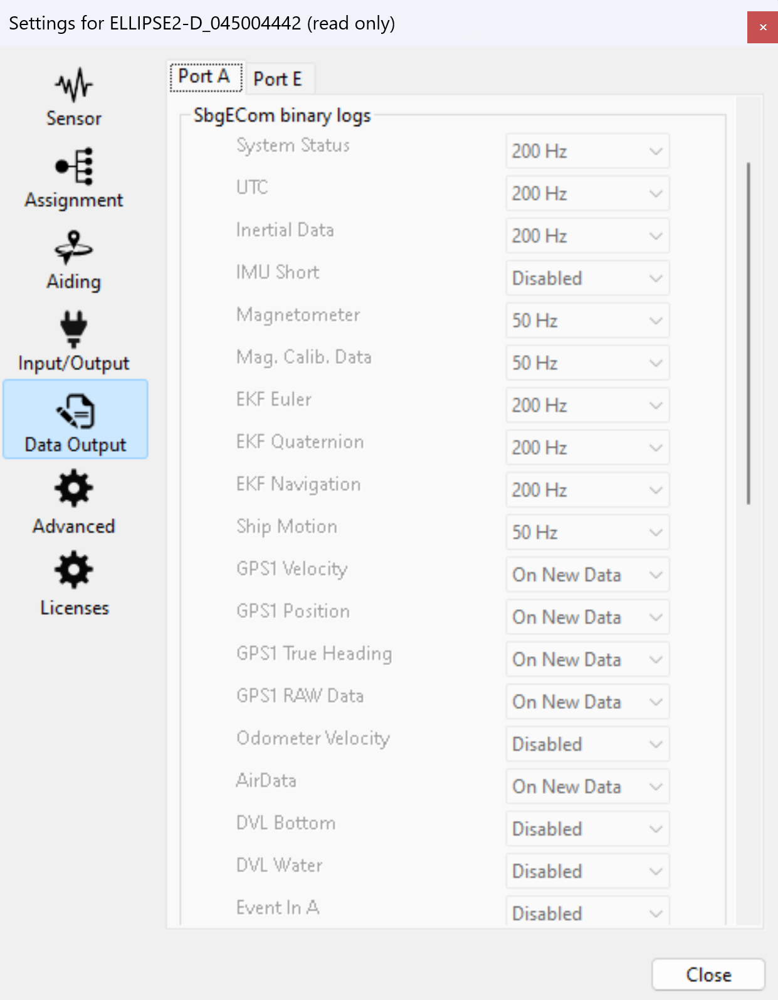
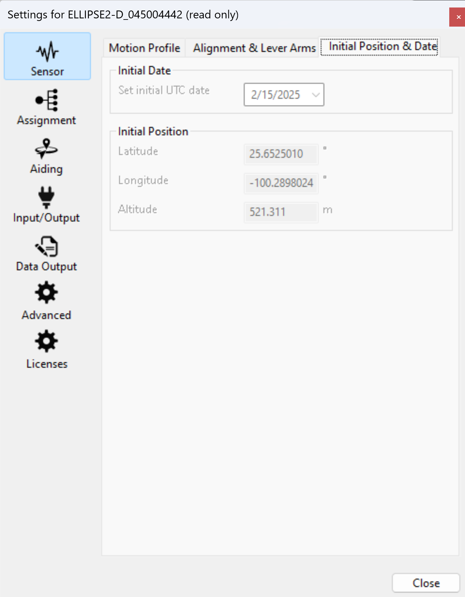
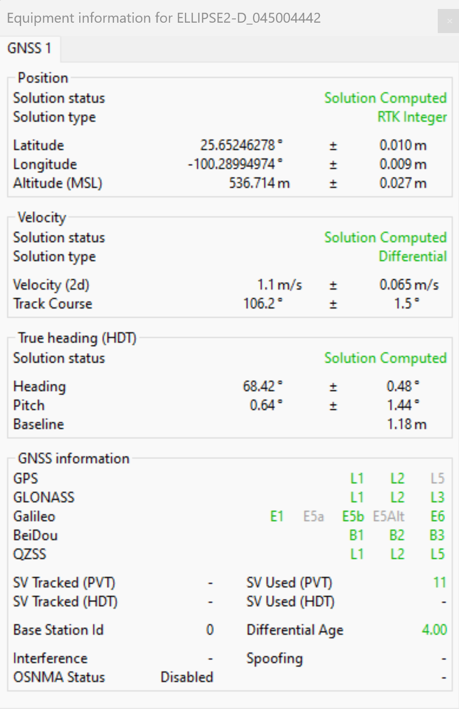
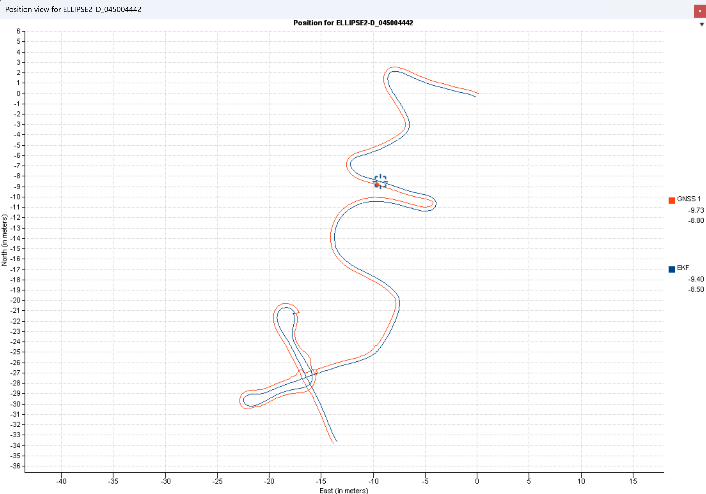

Localization
============

Setting up ELLIPSE-2D
---------------------

Author:
  * Demian Marin 

.. contents:: To enable remote communication from the OGS (On-Ground-Station) to the boat (Jetson Computer), the following tasks are performed:
  :depth: 2
  :local:

Introduction
************

Having an accurate and reliable pose is critical for control. For this the ELLIPSE2-D must be properly set in order to have a smooth and precise position and orientation. Most of this information was obtained from the manual (should be available on USV's Notion) and from technical support of SBG systems. Don't hesitate to get in contact with SBG's technical support if any problem arrives. But let's hope this docs saves the team time.
An `.sbgz` file has been uploaded to the USV's Notion where a recording a smooth trajectory and with no jumps can be played on sbgCenter. The settings are also available in the recording.

Antennas on the VTEC-S3
***********************

   (mechanical installation antennas on VTEC-S3)

Antennas should have a minimum of 1 m of separation and be pointing in the same direction.

.. note::
    The axis in red is the axis used for the position of the antennas when setup in "Mechanical Installation". And the axis in blue is the axis used for the "Alignment".
..

Settings in sbgCenter
*********************

Motion Profile
######################

   (Motion Profile)

An accurate and precise position and orientation was achieved with the default profile. Although Marine is supposed to handle the sway of the waves.

Interfaces
######################

   (Baudrate of interfaces)

Save the baudrate of Port A as it is the interface between the SBG and the Jetson (should be the same in the ROS2 configuration of the sbgdriver) - 921600 worked well. The baudrate of Port C is for the radio receiving from the RTK. This should be the same as the radio sender.

Aiding devices
######################

   (Enable Port C for RTK)

If using RTK and have a measurement of the lever arms of < 0.01 m. Then activate Port C.

.. note::
    RTK can provide an accuracy of 0.02 m if the `Solution Computed for Position` is `RTK Integer`. Without it the `Solution Computed for Position` will be SBAS or Differential which gives an accuracy of 1 m.
..

Alignment & Lever Arms
######################

   (Alignment of IMU)

The ellipse alignment is the IMU with respect to the USV.

Mechanical Installation
#######################

   (Mechanical Installation sbgCenter)

The position of the antennas (lever arms) are with respect to the orientation of the boat. If measurements are more than 0.05 m of tolerance then unselect ``The primary antenna lever arm has been measured precisely`` or select ``Rough lever arm`` for the second antenna.

Magnetometer
############

   (Magnetometer sbgCenter)

If the vehicle has a velocity smaller than 3m/s (like VTEC-S3) then one antenna and the magnetomer will not be useful. Thus 2 antennas are necessary. For the 2 antennas to work properly the magnetomer should be disabled.

Data Output
############

   (Frequency of Data output)

The highest frequency has worked well when tested. This was chosen to avoid gaps in the position or orientation when the control system reads them.

Initial Position & Date
#######################

   (Initial Position sbgCenter)

The current position and date can help the model with the calculations.

Expected Behaviour
*******************

The SBG should be left alone 5 to 10 min so it can properly calculate the solutions. When everything is correct then the solution in `Full Navigation` will be `Aligned` and the solution in `GNSS 1` will be `RTK INTEGER` if using RTK or `Differential` or `SBAS` if not using RTK.

GNSS 1 Solution
#################

   (GNSS 1 Solution Computed)

Position, Velocity and True Heading should be in green and should say `Solution Computed`.

Full Navigation
##################

..  figure:: usv_software_localization_images/full-navigation.png
   :align: center
   :width: 60%
   :figclass: align-center
   :alt: full navigation  

   (Full Navigation Aligned)

`Alignment status` should be `Aligned`. `Attitude`, `Heading`, `Velocity` and `Position` should be `ok` and green.

Example Trajectory
##################

   (Example of Trajectory)

If everything works correctly the graph in the sbgCenter should look smooth and with no jumps.

Troubleshoot
*******************

* Make sure that your measurements are as precise as possible, as this could be the reason why `Full Navigation` is not aligned.
* The antennas should have at least 1.0 m of separation. If not, this could be the reason for `Full Navigation` not being aligned.
* When testing is being done, the antennas should be under open sky. Nothing and no one should be covering them. Try to stay away from the antennas. The SBG cable is long enough (~70 cm) to not interfere with the signal.
* The `HDT` or `True Heading` is calculated with respect to the primary antenna. So if the primary antenna is not working properly, it doesn't matter if the second antenna is. The antennas are usually never the issue. Make sure the connectors and cables are making proper contact and are set correctly.
* If `Insufficient Obs` appears in red letters in the `GNSS 1 Solution`, this means there is a problem with the antennas. The most likely reason is an issue with the connectors or cables. Make sure they are making proper contact.
