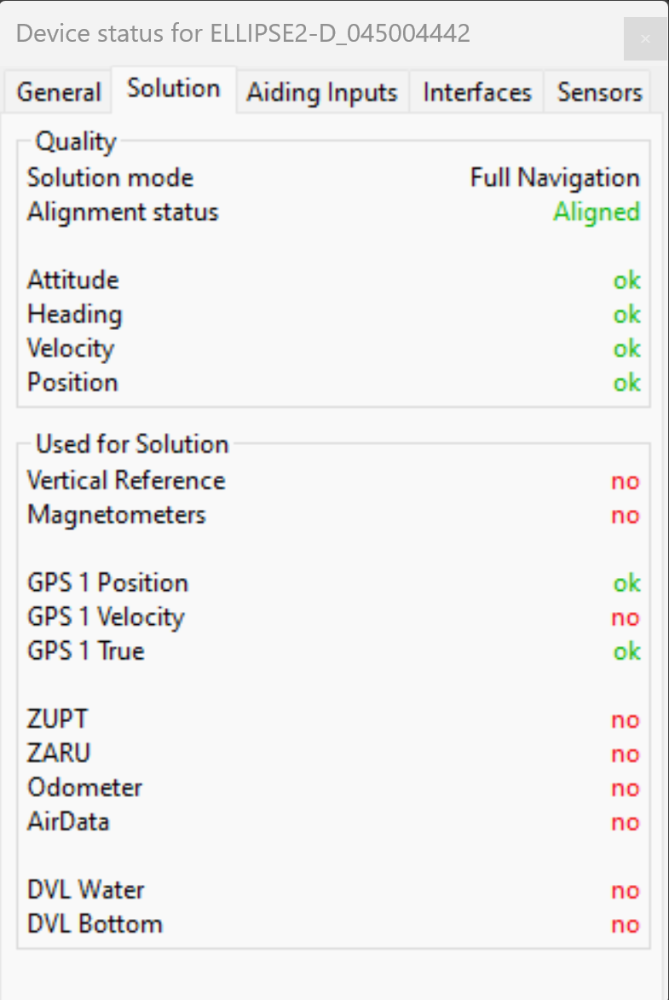

Localization
============

Setting up ELLIPSE-2D
---------------------

Author:
  * Demian Marin 

.. contents:: 
  :depth: 2
  :local:

Introduction
************

An accurate and reliable pose is critical for control. The ELLIPSE2-D must be properly configured to ensure smooth and precise position and orientation data. This documentation is based on the manufacturer's manual (available on USV's Notion) and technical support from SBG systems. Contact SBG's technical support for additional assistance if needed. This documentation aims to streamline the setup process.

An `.sbgz` file containing a recording of a smooth trajectory without position jumps is available on USV's Notion. The file includes the recommended settings.

Antennas on the VTEC-S3
***********************

..  figure:: usv_software_localization_images/vtec-s3_mechanical-installation_antennas.png
   :align: center
   :width: 80%
   :figclass: align-center
   :alt: mechanical installation antennas on vtec-s3

   (mechanical installation antennas on VTEC-S3)

The antennas require a minimum separation distance of 1 meter and must be oriented in the same direction.

.. note::
    The red axis represents the antenna positions in 'Mechanical Installation,' while the blue axis is used for 'Alignment.'
..

Settings in sbgCenter
*********************

Motion Profile
######################

..  figure:: usv_software_localization_images/motion-profile.png
   :align: center
   :width: 60%
   :figclass: align-center
   :alt: motion profile 

   (Motion Profile)

The default profile provides good performance. The Marine profile is designed to handle wave-induced motion.

Interfaces
######################

   (Baudrate of interfaces)

Port A baudrate configuration is critical for SBG-Jetson communication and must match the ROS2 sbgdriver configuration (921600 recommended). Port C baudrate must match the RTK radio transmitter settings. Validation 
with Holybro 915 MHz.

Aiding devices
######################

   (Enable Port C for RTK)

Enable Port C when using RTK with lever arm measurements of < 0.01 m precision.

.. note::
    RTK provides 0.02 m accuracy with 'RTK Integer' Solution Computed for Position. SBAS or Differential solutions provide 1 m accuracy.
..

Alignment & Lever Arms
######################

   (Alignment of IMU)

The ellipse alignment defines the IMU orientation relative to the USV frame.

Mechanical Installation
#######################

..  figure:: usv_software_localization_images/mechanical-installation.png
   :align: center
   :width: 60%
   :figclass: align-center
   :alt: mechanical-installation 

   (Mechanical Installation sbgCenter)

Antenna positions (lever arms) are specified relative to the vessel orientation. For measurement tolerances exceeding 0.05 m, deselect :guilabel:`The primary antenna lever arm has been measured precisely` or select :guilabel:`Rough lever arm` for the secondary antenna.

Magnetometer
############

..  figure:: usv_software_localization_images/magnetometer.png
   :align: center
   :width: 60%
   :figclass: align-center
   :alt: magnetometer 

   (Magnetometer sbgCenter)

For vehicles operating below 3m/s (such as VTEC-S3), dual antennas are required as single antenna and magnetometer configurations are insufficient. Disable the magnetometer when using dual antennas.

Data Output
############

..  figure:: usv_software_localization_images/data-output.png
   :align: center
   :width: 60%
   :figclass: align-center
   :alt: data ouput

   (Frequency of Data output)

Maximum frequency configuration optimizes data acquisition and minimizes position/orientation gaps in control system readings.

Initial Position & Date
#######################

   (Initial Position sbgCenter)

Current position and date parameters optimize model calculations.

Settings in Mission Planner
***************************

RTK antenna operation requires fixed position configuration through Mission Planner.

   (Settings of RTK in Mission Planner)

Position configuration procedure:

1. Select :guilabel:`Restart`
2. Wait for "Current Acc" to fall below 2
3. Once "Position is valid" appears (green indicator), select :guilabel:`Save Current Position`

Settings in U Center
********************

..  figure:: usv_software_localization_images/ucenter-f9p.png
   :align: center
   :width: 100%
   :figclass: align-center
   :alt: ucenter-settings 

   (Settings of F9P in U Center)

Configure the baudrate to match the radio settings. Validated with Holybro 915 MHz 100mW.

Expected Behaviour
*******************

The SBG system requires 5 to 10 minutes of initialization for proper solution calculation. Although must green status were achieved in less than a 1 minute when testing. 
When properly configured, the Full Navigation solution indicates "Aligned" status, and the GNSS 1 solution shows "RTK INTEGER" (with RTK) or "Differential"/"SBAS" (without RTK).

GNSS 1 Solution
#################

   (GNSS 1 Solution Computed)

Position, Velocity, and True Heading indicators should display "Solution Computed" with green status.

Full Navigation
##################

   (Full Navigation Aligned)

System status requirements:

- Alignment status: "Aligned"
- Green status indicators for Attitude, Heading, Velocity, and Position

Example Trajectory
##################

   (Example of Trajectory)

Proper configuration results in smooth trajectory visualization without position jumps in sbgCenter.

Troubleshoot
*******************

1. Alignment Issues

   * Precise lever arm measurements are essential for Full Navigation alignment
   * Maintain minimum 1.0 m antenna separation

2. Signal Quality

   * Ensure clear sky visibility for antennas
   * Minimize personnel proximity to antenna locations. Utilize full cable length (approximately 70 cm) to prevent signal interference

3. Heading Calculation

   * True Heading (HDT) calculation references the primary antenna. If primary antenna is not working then True Heading won't be achieved.
   * Verify primary antenna connectivity and cable integrity

4. GNSS Solution

   * "Insufficient Obs" error indicates antenna system issues. Inspect connector integrity and cable connections
