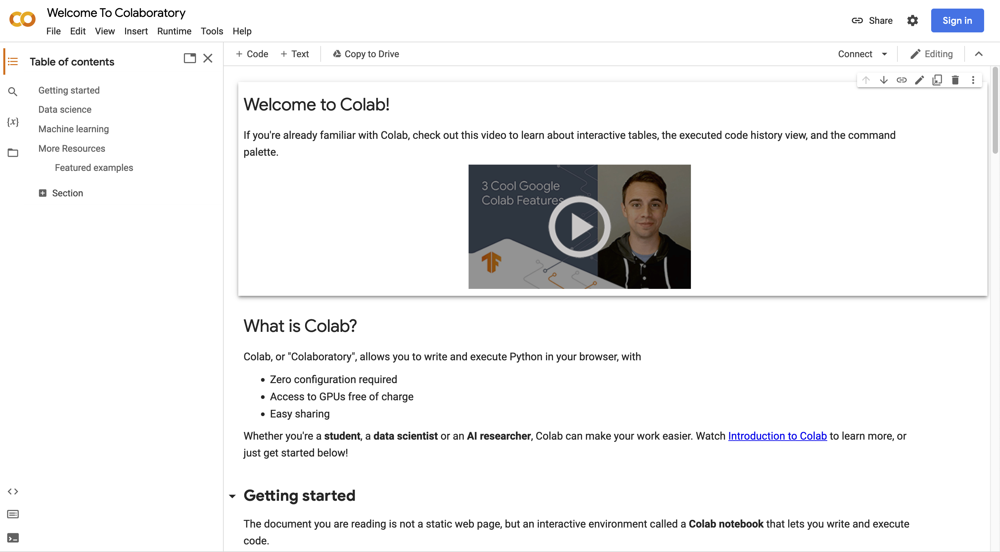
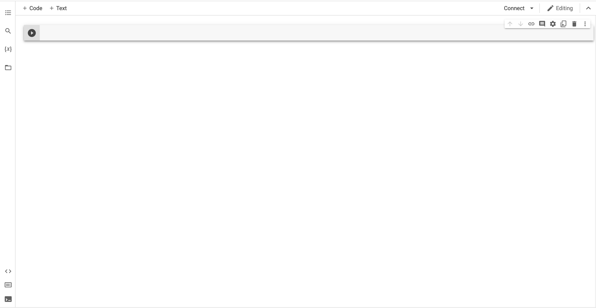
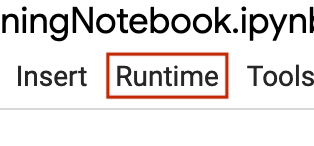
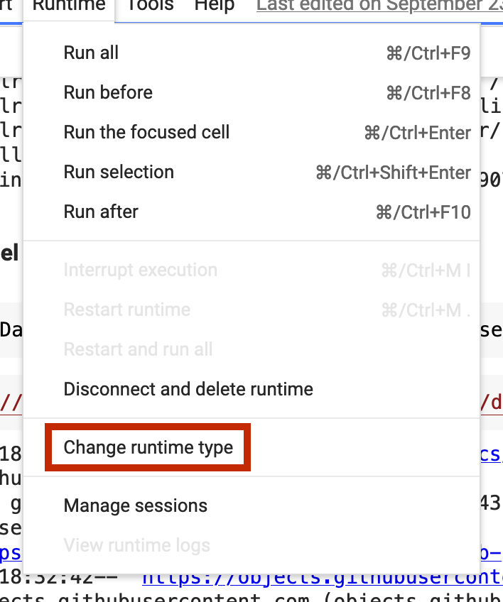
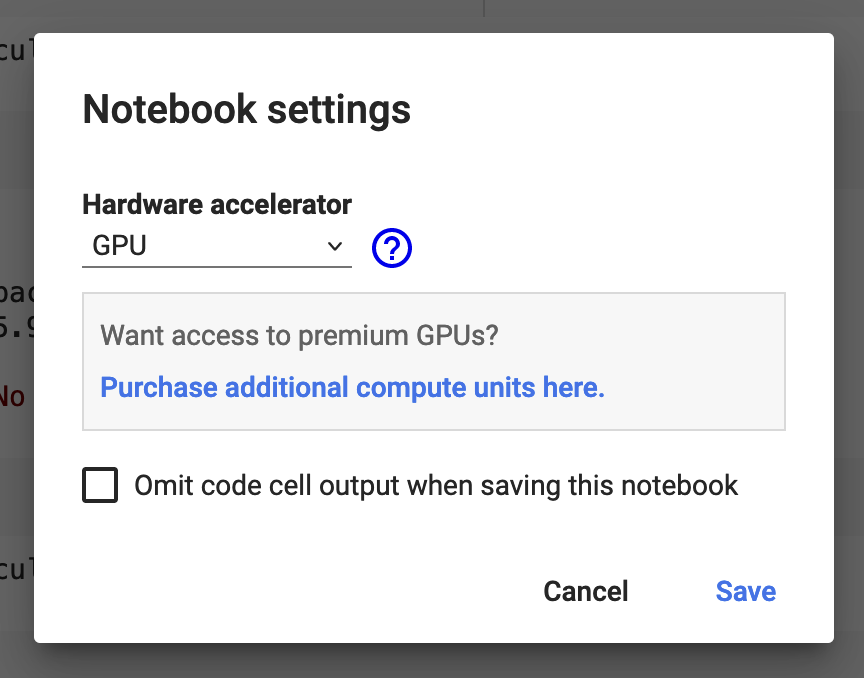

Perception
==========

Training YoloV5 on Google Colab
-------------------------------

Introduction
************
Let's say you have a big dataset of highly specific things you would like to train a machine learning algorithm to recognize. Well, you are in the right place. This is a long process, full of little quirks and settings to tweak in order to find the perfect combination of adjustments, but that's the fun part of this, so don't worry.

Why Google Colab?
*****************
Unless you have an expensive machine with a graphics card that supports CUDA, you are better of using something like Google Colab that offers this computing power for free. Long live to the free and open computing!

How Google Colab?
*****************
Google Colab is like a linux virtual machine, but running on your browser tab, so if you are familiar with linux, this will be easy. If you don't know anything about linux, don't worry, i'll guide you to the right commands.

.. warning::
    Please don't abuse google colab's notebooks, they were kind enough to offer them as a free and excellent tool.
..

Let's start:
************

**1 - Opening Google Collab**
    - Navigate to https://colab.research.google.com on a web browser, you should see something like (Figure 1). Before anything, sign-in with your Google account, and then proceed to create a new notebook by clicking :code:`File > New Notebook`. This will redirect you to your oficial first google colab notebook.

   (Figure 1)

.. note::
    You should probably rename the notebook to something more familiar.
..

**2 - Colab's Interface (Figure 2)**
    - If you type something in that line and press :code:`cmd or ctrl + enter`, then line will be executed as a normal python interpreter would do.
    - But here's the catch, if you add an interrogation mark :code:`!` before any of your commands, these will be not interpreted as python commands, rather a linux shell command. So expect your typical ls, mv, cp, rm, etc commands.

   (Figure 2)

**3 - Checklist**

    - Dataset in YoloV5's format (If you don't know the format of your dataset, you can use roboflow.com, but it's usage is out of the scope of this tutorial).
     - Upload this to the same google account's drive you used to create the notebook.
    - Decide on which YoloV5 model to train. (`Here <https://github.com/ultralytics/yolov5#pretrained-checkpoints>`_ are the models and it's differences. tldr, bigger means better but longer to train and run).

**4 - Configuring YoloV5**

.. code-block:: python
    :caption: Mounts Google Drive as a folder you can access, so no progress is lost.

    from google.colab import drive
    drive.mount('/content/drive')
..

----

.. code-block:: shell
    :caption: Changes the directory to an actual folder inside your google drive, here will be the base of everything you download and train.
    
    %cd /content/drive/FOLDER
..

.. note::
    - Replace FOLDER above^ with the actual folder inside of your drive.
    - This folder should also have your dataset.
..

----

.. code-block:: shell
    :caption: Clones the code for yolov5 and then move to that recently downloaded folder.

    !git clone https://github.com/ultralytics/yolov5
    %cd yolov5
..

----

.. code-block:: shell
    :caption: Installs all the python dependencies needed by yolo.

    !pip install -r requirements.txt
..

**5 - Configuring setup files**

.. code-block:: shell
    :caption: Unzips dataset into a folder named dataset in the current directory.

    !unzip -q ../DATASET.zip -d ./dataset
..

.. note::
    - Replace DATASET.zip above^ with the actual zip file of your dataset.
..

----

.. code-block:: shell
    :caption: Downloads the pretrained checkpoint into the current folder.

    !wget "https://example.com/yolo.pt"

..

.. note::
    - Replace example.com with the actual yolo checkpoint download link you chose on step 3. (Eg. https://github.com/ultralytics/yolov5/releases/download/v6.2/yolov5l.pt)
..

**6 - GPU Usage**

Now it's time for you to train your AI model, for this you will have to check an option directly in colab's interface. This step is very important unless you want to wait an eternity for your model to finish training.

- First, click on the runtime button in the menubar.

   (Figure 3)

- Then select "Change runtime type" on the dropdown

   (Figure 4)

- And finally, change the value from "None" to "GPU", and click save.

   (Figure 5)

**7 - Training**

The command you will want to run to finally train your model is the following:

.. code-block:: shell

    !python train.py --batch 24 --epochs 80 --data dataset/data.yaml --weights "yolov5l.pt" --device 0

..

Just rememmber to change the parameters "data" and "weights" accordingly to what you previously downloaded. Also, "batch" and "epochs" are other settings you can try modifying, in short, "epochs" means how many iterations of the training should be done, and "batch" is how many training-examples are show to the algorithm at a time. You can read more about this in this `link <https://towardsdatascience.com/epoch-vs-iterations-vs-batch-size-4dfb9c7ce9c9>`_.

.. note::
    After the training is done, the final weights will be available on the runs/train/exp/weights folder, were last.pt is the last trained model and best.pt is the one showing best results.
..

.. warning::
    Don't close the tab, and keep going back to it every 10 min. approx, otherwise colab will close your session if it detects you left it unattended.
..

